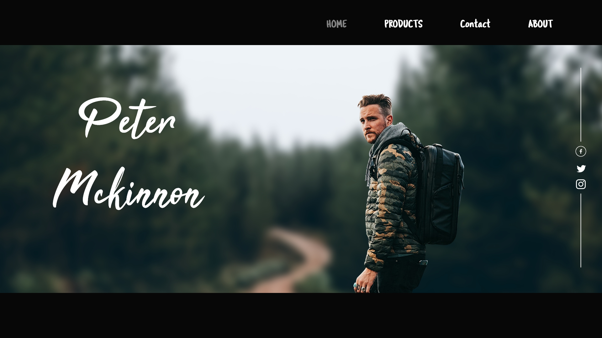

# petermckinnon.github.io

## Description
This project is a personal tribute to the talented photographer and filmmaker, Peter McKinnon. As an ardent admirer of his work, I wanted to showcase some of the incredible products he sells. The website offers a visually appealing display of his mesmerizing photos and films, allowing visitors to get a glimpse of his remarkable talent.

## Features
- Beautifully designed UI showcasing Peter McKinnon's products.
- Explore an array of stunning photographs and captivating films.
- Learn about Peter McKinnon and his inspiring journey.

## How to Use
1. Clone the repository: `git clone https://github.com/your-username/peter-mckinnon-website.git`
2. Open `index.html` in your web browser.
3. Enjoy exploring Peter McKinnon's world!

## Live Demo
Check out the live demo [here](https://your-username.github.io/peter-mckinnon-website).

## Contributing
Your contributions are welcome! Please read our [Contribution Guidelines](CONTRIBUTING.md) before submitting a pull request.

## License
This project is licensed under the [MIT License](LICENSE).

Let's celebrate the artistry of Peter McKinnon together! 📸🌎
